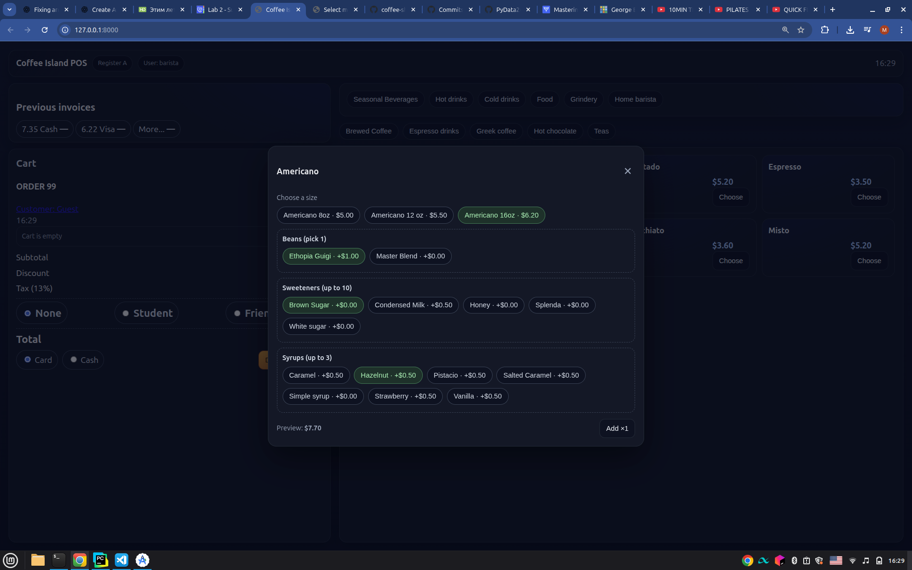

# Personal diary

This document is describing my thoughts and feelings as well as the process of creating the application for fun and reflection purposes.

## Day 1

After finishing [Django Application Development with SQL and Databases](https://www.coursera.org/learn/developing-applications-with-sql-databases-and-django?specialization=ibm-full-stack-cloud-developer)
course I was willing to apply the knowledge I received and put it into something good for my portfolio, something that will level up my skills and make the software development journey more fun. 
Working as a barista, I quickly came up with an idea of POS machine app-simulator for my cafe. The one we use is outdated, complicated, with a lot of unnecessary buttons and overloaded structure.
I wanted to implement similar model, but with more user-friendly design, clear and coherent system and aim to show my Django skills.
During my evening shift, when we did not have many customers, I began to draw the class diagram on empty cheques.

## Day 2

Initial set up was created. I discussed with Chat GPT how to make the whole development more formal - like it was my real job to complete, like someone asked me to develop this app.
That is how deliverables were created. Some concepts were simplified - we do not need discount per item, when we can do discount per order (at least for now). 
First version of class diagram was created, then there are the models with simple fields that will expand later. There is a complete undesrtanding of the next steps.

## Day 3

Had a morning shift and some stuff to do before the college begin, so did not have much time for continuing development. Added some items, categories and groups to db.

## Day 4

Added Modifiers and Variants: every drink has one/two/three sizes and a price depends on that size, so there was a need to reflect this in db and then in UI. Was thinking of adding "modifiers"
like syrups, extra shots, milks, etc. as MenuItems (as they are also in the menu, they also have price) but decided to make it a separate table in db (might be changed in the future).
Had a first thought of this diary. Added all espresso drinks from the menu to db in order to have at least one totally completed section that can be used as a reference while dealing with UI.

## Day 5

Desided to implement partial UI before implementing session cart - it is easier to come with new concepts and understand the development proccess when you can see the practical result needed.
It did take a while to do the templates, though I had our cafe's app design in my phone, due to the fact that I wanted to make it better. 
However, the most difficult part was a) imagining future views b) applying JS in a way that parent categories are shown separate of subcategories 
(e.g. you see only hot drinks/cold drinks first, then click on hot drinks and see espresso drinks/teas/chocolates/etc). Don't like the final result completely, however, looks not that bad.
Might add a category like "most popular drinks" that would be default and showing most often bought items, but it would be implemented after statistics added to manager account and staff like that.

## Day 6.

For now, the most complicated part for me is integrating variants of items into template. After couple of hours filtering with js and trying to make prices look normal, I realized that MenuItems price_cents differs from Variant base_price_cents and that is why the price with ExpressionWrapper was not workinb. 
Similar problem with Modifiers: I want them to be different for different item groups (e.g. Food does not need to have "add syrup/extra shot", right?). I will change models again and attach groups to categories (perhaps items in the future?)

## Day 7.

Continued working on modifiers: after they were shown in UI almost correctly, I realized that "milk" group was nowhere to be seen, though I attached it to both specific drinks and items categories. Needed to refactor the code a bit and assign each model unique id connected with item$ before that I was using the same ids ( like id="modal") for every one. Ih helped to make the code clearer and render template with correct modifiers. JS is a bit hard for me, I use a lot of help with that, but still learning. Planning to finish the correct price display for the whole modal window today, though my classes have started. 

## Day 8.

Basically spent the whole day trying to make the price look correctly. THought that my decision of making it in cents first was wrong - because now i had to deal with this whole transition from "100" to beautiful "$1.00". Sometimes the program still added just hundreds of cents, sometimes it cut the whole part after the point. I wanted every variant/modifier to show its price in the modal window, so it would be easier to show the same thing in cart (then in orders created). Got a bit tired after classes and work, so that was all I had metal strength to do that day.

## Day 9.

Modals with all the variants/modifiers were working correctly (except resetting the modal), so I decided to prepare for the car integration. Step by step I added helper functions - to get the cart, make a cart snapshot (to have an idea how the cart looks and to use it in the future). The validation of all prices was the hardest one i guess, but the most needed one. Began to create some views for GET and POST and added them to urls. Already thinking of some changes that will be made in the future.

## Day 10.

Feels like Saturdays are the busiest days for me: after work I had to do a lot of stuff, make some calls and just got exhausted after a busy weeks, so I did not feel the mood to program a lot. Still added update/remove line of cart ad I planned before. Overall I see the vision how it is supposed to look on frontend, however, a bit confused how to make variants/modifiers look better. Decided to deal 
with subtotal/tax/total a bit later.

## Day 11.

Workin hard but making progress, Using cart template I created before and the payload, i tried to render cart: it was a complete mess. I even forgot to add moke views in urls.py. Begin to think that i need to break script.js into several files - it becomes too messy and I keep forgetting about the helper functions I created before. In one youtube video I saw an approach to make a cart as a separate directory/app and then attach them (though the video was about online shop e-commerce, not the POS). Might think about this option later as well, after I get the whole working app. For now, I tried to make all the buttons work (+-1, remove, add to cart) and it seemed to make a big step forward.
Still have problems with variants' prices. All those transitions forward and backward to cents and dollars make them look different, I need to sync them somehow.

## Day 12.

Woke up with thought that I need not only to write about progress, but take pictures of it - why didn't i do it earlier? Now it is a bit useless since I am fixing bugs, but later, after I fix them all, I might share it here. For now, I finished debugging price (yey!), now it correctly counts all the modifiers, variants and even tax! Time to add discount and total + rounding cents (for now they are the most difficult part).

## Day 13.

Had so many labs to do and house chors, that decided to take a small rest from the app. Tried to fix the rounding cents, did not workout for now. Updated this journal and a lot of db rows - now we have seasonal beverages, cold drinks, etc.

## Day 14.

Final fix for the total, tax and discount! Rounding cents are not working for now, but I decided to keep it for later. Still proud of myself - I can consider POS homepage ready (with some exceptions) and almost fully functional. Next day will start authorization/permissions, then orders, but for not: here is day 14 ui.

